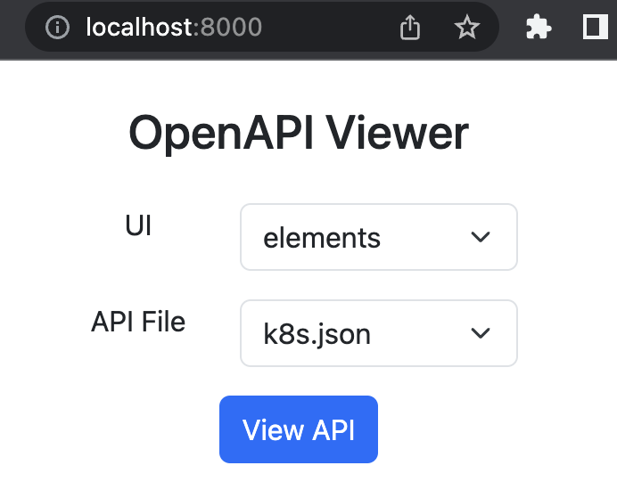

# Local OpenAPI Viewer


## play
run in docker and visit http://localhost:8000 in browser
```shell
docker run -it --rm -p 8000:8000 --entrypoint bash zengxu/openapi-ui
```

## dev
```shell
make dev
```

## publish
```shell
make
```
